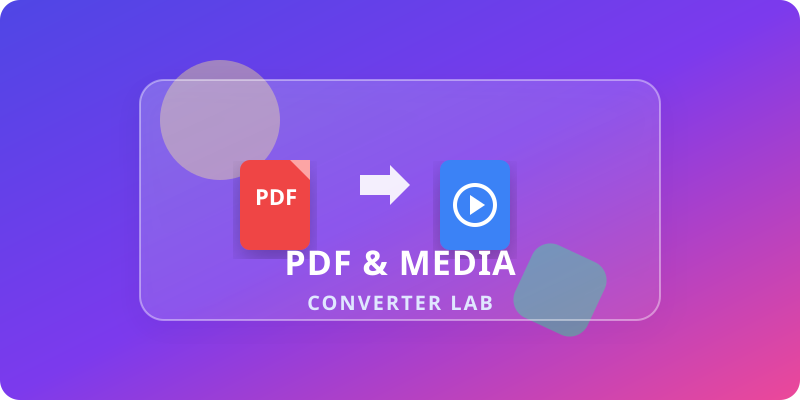

<div align="center">


# PDF & Media Converter Lab

[](https://reactjs.org/)
[](https://vitejs.dev/)
[](https://tailwindcss.com/)
[](https://www.typescriptlang.org/)
[](https://opensource.org/licenses/MIT)

*The ultimate playground for fast, reliable, and secure PDF and media conversions.*

</div>

## ✨ Features

- **Convert PDFs**: Convert seamlessly between various document and image formats.
- **Split & Merge**: Easy manipulation and reorganization of PDF pages.
- **Compress**: Optimize PDF size locally without uploading to external servers.
- **AI Powered**: Built with Gemini API integration for smarter features.

## 🚀 Run Locally

**Prerequisites:** Node.js

1. Clone the repository and install dependencies:
   ```bash
   npm install
   ```
2. Set the `GEMINI_API_KEY` in `.env.local` to your Gemini API key.
3. Run the application locally:
   ```bash
   npm run dev
   ```

View your app in AI Studio: [AI Studio App](https://ai.studio/apps/1a6739fc-3294-41f2-80b9-b459c391431e)
